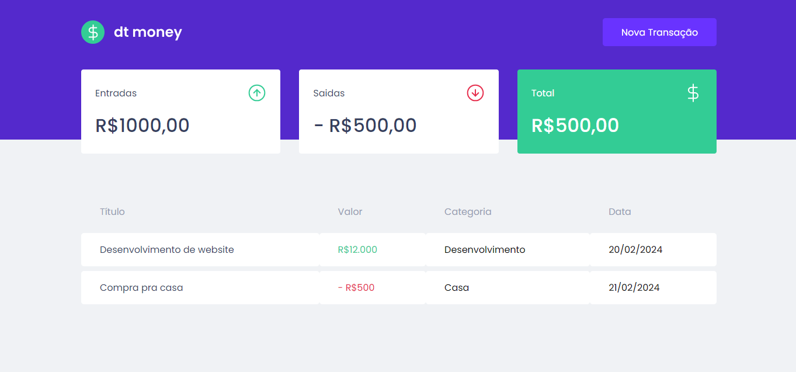

<div align="center" id="top"> 
  

  &#xa0;

  <!-- <a href="https://dtmoney.netlify.app">Demo</a> -->
</div>

<h1 align="center">Dt money</h1>

<p align="center">
  

  

  
</p>

<!-- Status -->

<!-- <h4 align="center"> 
	🚧  Dtmoney 🚀 Under construction...  🚧
</h4> 

<hr> -->

<p align="center">
  <a href="#dart-about">About</a> &#xa0; | &#xa0; 
  <a href="#sparkles-features">Features</a> &#xa0; | &#xa0;
  <a href="#rocket-technologies">Technologies</a> &#xa0; | &#xa0;
  <a href="#white_check_mark-requirements">Requirements</a> &#xa0; | &#xa0;
  <a href="#checkered_flag-starting">Starting</a> &#xa0; | &#xa0;
  <a href="https://github.com/felicio-almd" target="_blank">Author</a>
</p>

<br>

## :dart: About ##

Projeto de controle de finanças pessoais, a pessoa pode cadastrar todas as entradas e saidas de finanças, 
mostrando todas transações com nomes especificios, é possivel cadastrar novas transações como entrada ou saida,
utilização de modal para a tela de transação, projeto feito com boas práticas de frontend.
Usando react, typescript e styled components


## :sparkles: Features ##

:heavy_check_mark: Feature 1: ReactJs and components\
:heavy_check_mark: Feature 2: Typescript\
:heavy_check_mark: Feature 3: Backend MirageJS, consuming API\
:heavy_check_mark: Feature 4: Styled Components;

## :rocket: Technologies ##

The following tools were used in this project:

- [Node.js](https://nodejs.org/en/)
- [React](https://pt-br.reactjs.org/)
- [TypeScript](https://www.typescriptlang.org/)

## :white_check_mark: Requirements ##

Before starting :checkered_flag:, you need to have [Git](https://git-scm.com), [yarn] and [Node](https://nodejs.org/en/) installed.

## :checkered_flag: Starting ##

```bash
# Clone this project
$ git clone https://github.com/felicio-almd/dtmoney

# Access
$ cd dtmoney

# Install dependencies
$ yarn install

# Run the project
$ yarn start

# The server will initialize in the <http://localhost:3000>
```

## :memo: License ##

This project is under license from MIT. For more details, see the [LICENSE](LICENSE.md) file.


Made with :heart: by <a href="https://github.com/felicio-almd" target="_blank">Felicio</a>

&#xa0;

<a href="#top">Back to top</a>
